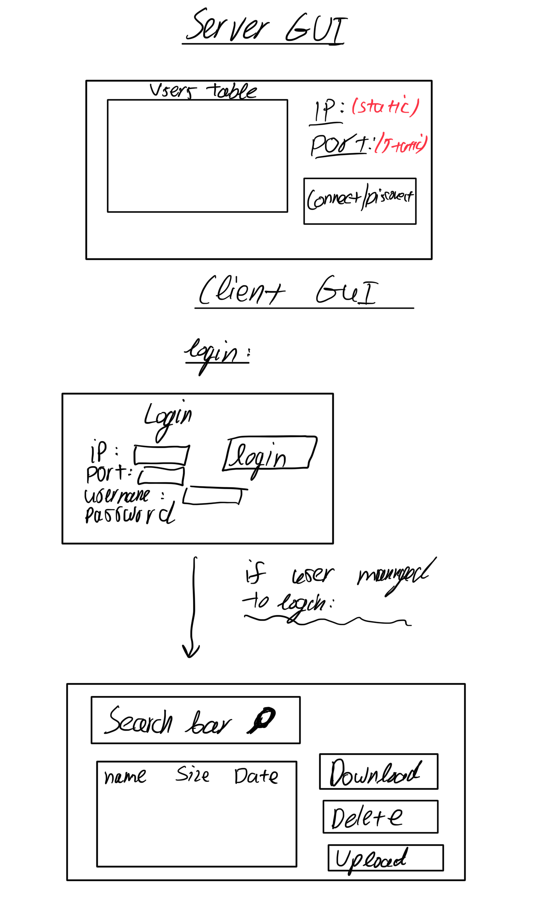

# ☁️ SkyVault — Secure Cloud Storage System

  

SkyVault is a Python-based client-server application that provides **secure file storage and management** between users and a cloud server.  

It combines **network programming**, **data encryption**, and a **graphical user interface (GUI)** to simulate a real-world cloud storage platform.

  

---

  

## 🚀 Features

  

- 🔒 **User Authentication** — Secure login system for users.  

- 📁 **File Upload & Download** — Send and retrieve files between client and server.  

- 🧠 **Client–Server Architecture** — Separate logic for client and server communication.  

- 🪟 **Intuitive GUI** — Built using `tkinter` for an easy and simple user experience.  

- 🧰 **Error Handling & Validation** — Prevents corrupted file transfers or invalid actions.  

- 🧾 **Documentation Included** — Project report and GUI design diagrams provided.  

  

---

  

## 🧩 Project Structure

  

```

📦 Project/

├── CClientBL.py              # Client-side business logic

├── CServerBL.py              # Server-side business logic

├── StorageGUI.py             # Graphical interface for the client

├── requirements.txt          # Python dependencies

├── GUIDesign.PNG             # Interface mockup

├── תיק פרוייקט.DOCX          # Hebrew version of project document

└── README.md

```

  

---

  

## ⚙️ Installation

  

### 1️⃣ Clone the Repository

```bash

git clone https://github.com/ohadbekhor0705/Project.git

cd Project

```

  

### 2️⃣ Install Requirements

```bash

pip install -r requirements.txt

```

  

---

  

## ▶️ Usage

  

### 🖥 Start the Server

Run the server script first:

```bash

python CServerBL.py

```

  

### 💻 Start the Client

Then launch the client GUI:

```bash

python StorageGUI.py

```

  

The GUI allows you to:

- Log in or register a new user  

- Upload or download files  

- View stored files on the cloud server  

  

---

  

## 🧠 Technical Details

  

- **Language:** Python 3.x  

- **GUI Framework:** Tkinter  

- **Networking:** TCP sockets  

- **Security:** Basic encryption for file transfer (implemented in `CClientBL.py` and `CServerBL.py`)  

  

---

  

## 📸 GUI Preview

  



  

---

  

## 📄 Documentation

  

Full documentation and project explanation can be found in:

- `Cyber-protection-and-operating-systems-Project.pdf`

- `תיק פרוייקט.DOCX`

  

---

  

## 🧑‍💻 Author

  

**Ohad Bekhor**